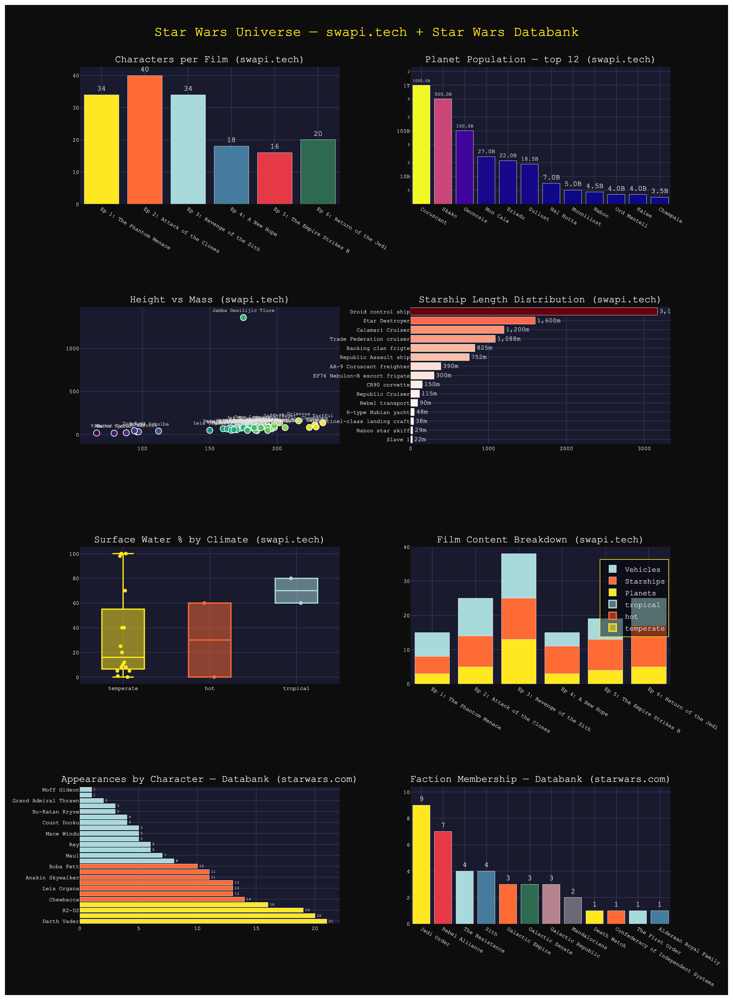
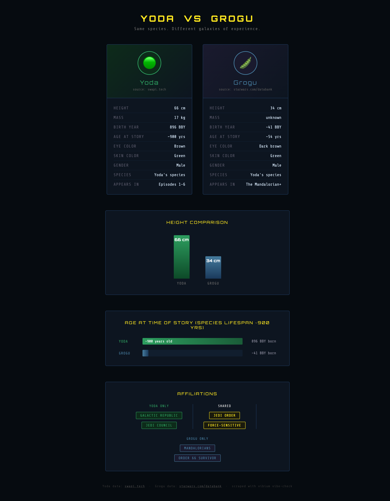

# swapi-dashboard

Scrapes the [Star Wars API](https://swapi.tech/) and generates a dark-themed interactive Plotly dashboard — all from the command line using the [vibium](https://vibium.io) vibe-check CLI for browser automation.

**Live dashboard:** https://lana-20.github.io/swapi-dashboard/



## What it does

1. Uses **vibium** (`/vibe-check`) to navigate swapi.tech and discover all API endpoints
2. Fetches all 6 resource types via `curl` + Python
3. Pulls detail records for every entry (82 people, 60 planets, 36 starships)
4. Renders a self-contained interactive HTML dashboard with Plotly

## Dashboard panels

| Panel | Description |
|---|---|
| Characters per Film | Prequel trilogy peaks at 40 characters vs 16–20 in the originals |
| Planet Population | Log-scale bar — Coruscant dominates at 1 trillion |
| Height vs Mass | Scatter plot — Jabba the Hutt is the obvious outlier at 1,358 kg |
| Starship Length | Death Star at 120,000 m dwarfs the entire fleet |
| Surface Water % by Climate | Box plot grouped by climate type |
| Film Content Breakdown | Stacked bar: planets + starships + vehicles per episode |

## Bonus: Yoda vs Grogu

Cross-source comparison — Yoda from swapi.tech, Grogu scraped from the Star Wars Databank using vibium.

**Grogu — Star Wars Databank**


**Yoda vs Grogu comparison**



## Files

| File | Description |
|---|---|
| `SKILL.md` | Skill definition and step-by-step instructions |
| `swapi_viz.py` | Scrape + Plotly script |
| `index.html` | Live interactive dashboard (served via GitHub Pages) |
| `yoda_vs_grogu.html` | Yoda vs Grogu static comparison viz |

## Usage

```bash
pip3 install plotly pandas
python3 swapi_viz.py
open /tmp/swapi_dashboard.html
```

Or invoke as a Claude Code skill: `/swapi-dashboard`
